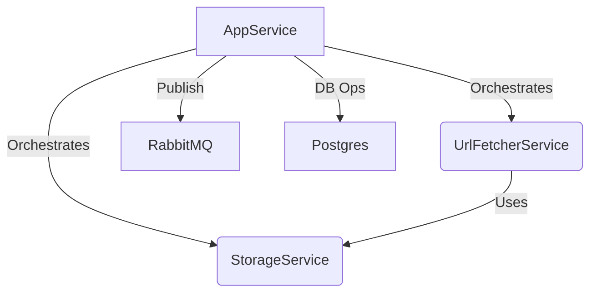

```mermaid
graph TD
    A[AppService] -->|Orchestrates| B(StorageService)
    A -->|Orchestrates| C(UrlFetcherService)
    C -->|Uses| B
    A -->|Publish| D[RabbitMQ]
    A -->|DB Ops| E[Postgres]
```
