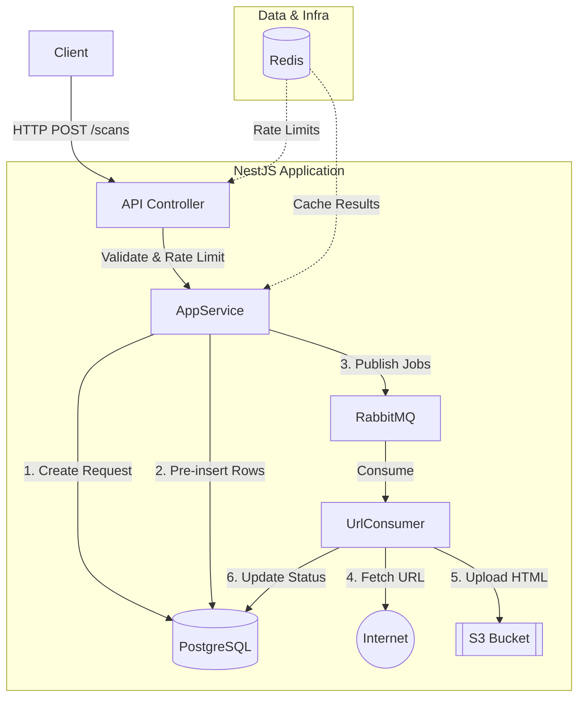
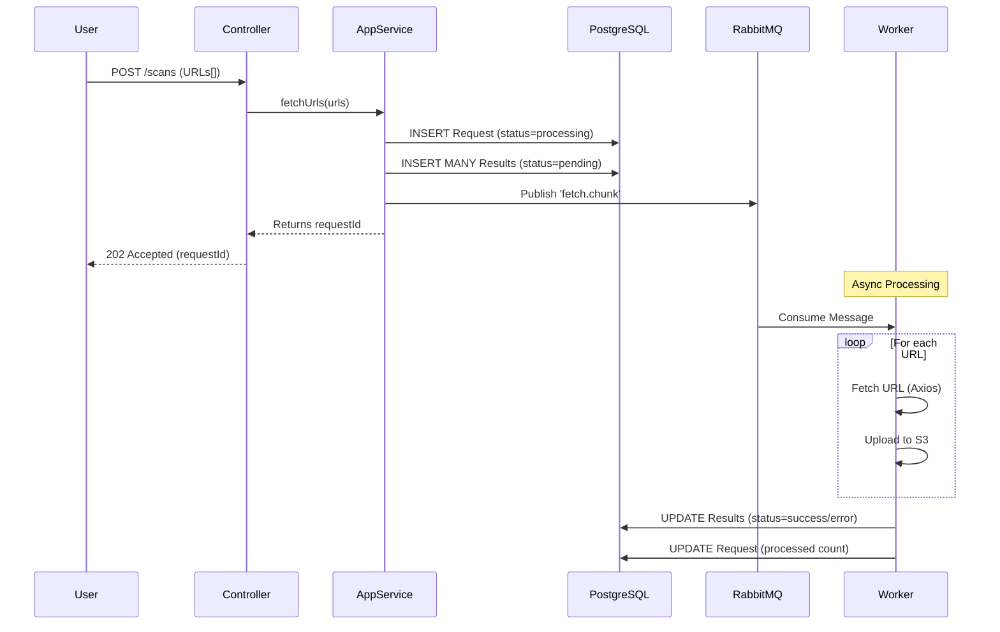

# System Architecture

## Overview
The **Guardz Fetch Service** uses an asynchronous, distributed architecture to handle high-volume URL fetching. It separates the request ingestion (Producer) from the actual processing (Consumer) using a reliable message queue.

## Components

### 1. API Layer (NestJS Controller)
- **Role**: Entry point for user requests.
- **Responsibilities**:
    - Validates inputs using DTOs.
    - Enforces Rate Limiting (Global & per-endpoint).
    - Checks API Keys.
    - Delegates business logic to `AppService`.

### 2. Service Layer (Producer)
- **Role**: Orchestrator.
- **Responsibilities**:
    - Creates initial request records in PostgreSQL.
    - Chunks large lists of URLs.
    - Pre-inserts rows into the `Results` table.
    - Publishes messages to **RabbitMQ**.

### 3. Worker Layer (Consumer)
- **Role**: Background Processor.
- **Responsibilities**:
    - Listens to RabbitMQ queue `fetch_queue_rabbitmq`.
    - Fetches URLs via HTTP.
    - Handles redirects and timeouts.
    - Uploads HTML content to **S3**.
    - Updates PostgreSQL with status and S3 keys.

### 4. Infrastructure
- **PostgreSQL**: Relational DB for request metadata and job status.
- **Redis**: Used for Rate Limiting storage and Caching of finished results.
- **RabbitMQ**: Message broker for reliable task distribution.
- **LocalStack (S3)**: Object storage for the raw HTML content.

## Architecture Diagram

## Request Flow (Sequence)

